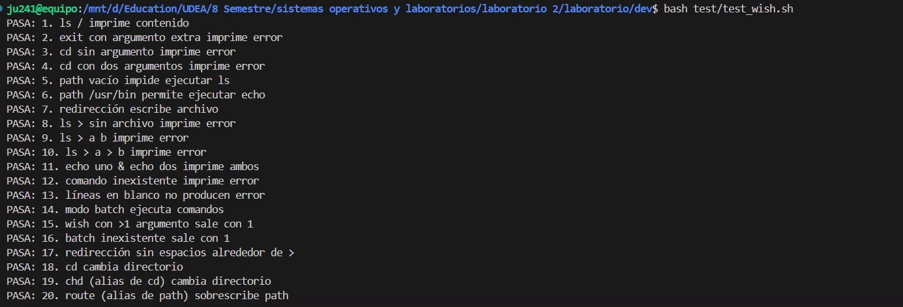

# Práctica No. 2: API de Procesos — Wisconsin Shell (wish)

**Juan Pablo Cardona Aristizabal**
juan.cardona59@udea.edu.co — 1.041.204.949

**Cristian Alberto Agudelo Marquez**
cristian.agudelo1@udea.edu.co — 1.041.268.267

[2554842] SIST. OPERAT. Y LAB.
Johnny Alexander Aguirre Morales

**UNIVERSIDAD DE ANTIOQUIA**
Facultad de Ingeniería — Ingeniería de Sistemas
Laboratorio de Sistemas Operativos — 2026

---

# 1. Introducción

Esta práctica tiene como objetivo familiarizarse con la API de procesos POSIX (`fork()`, `execv()`, `wait()`/`waitpid()`) implementando un intérprete de comandos simplificado llamado **wish** (Wisconsin Shell). El shell debe ser capaz de funcionar en modo interactivo y en modo batch, resolver ejecutables mediante un search path configurable, ejecutar comandos integrados (`exit`, `cd`, `path`), redirigir la salida estándar y la salida de error a un archivo, y lanzar comandos en paralelo con el operador `&`.

La aplicación fue desarrollada en C estándar (C99) con las extensiones POSIX habilitadas, compilada con `gcc -Wall -Wextra` y probada en Ubuntu 24 dentro de WSL. Se ejecutaron 20 casos de prueba automatizados que cubren todas las funcionalidades requeridas por el enunciado y por las recomendaciones dadas por el profesor en clase (grabación del 16 de marzo de 2026).

---

# 2. Documentación de Funciones

A continuación se describen todas las funciones implementadas en `wish.c`, sus parámetros, propósito y efectos.

| Programa | Función / Rutina | Propósito | Retorno / Efecto |
| :---- | :---- | :---- | :---- |
| wish.c | `main(argc, argv)` | Punto de entrada. Delega en `wish()` para mantener `main` simple y uniforme con el laboratorio anterior. | Retorna el valor devuelto por `wish()`. |
| wish.c | `wish(argc, argv)` | Inicializa el modo (interactivo o batch), el path por defecto y el ciclo principal de lectura con `getline()`. Al detectar EOF invoca `exit(0)`. | No retorna; sale del proceso con `exit(0)` ante EOF o con `exit(1)` si se invoca con más de un argumento o un batch file inválido. |
| wish.c | `print_error()` | Imprime el único mensaje de error permitido (`"An error has occurred\n"`) a `stderr` usando `write()`. | void. |
| wish.c | `inicializar_path()` | Establece el search path inicial del shell con un único directorio: `/bin`. | void; deja `g_path` con un elemento. |
| wish.c | `liberar_path()` | Libera la memoria asociada a cada entrada del search path y al arreglo contenedor, asignando `NULL` para evitar punteros colgantes. | void. |
| wish.c | `establecer_path(dirs, n)` | Sobrescribe el search path actual. Libera el path anterior, reserva memoria nueva para `n` punteros y copia cada cadena con `strdup()`. Si `n == 0` deja el path vacío. | void. Modifica `g_path` y `g_path_len`. |
| wish.c | `buscar_ejecutable(comando)` | Recorre el search path y usa `access(..., X_OK)` para verificar si el ejecutable existe en alguno de los directorios. | Devuelve una cadena recién reservada con la ruta absoluta (el llamador debe hacer `free`), o `NULL` si no se encuentra. |
| wish.c | `normalizar_operadores(linea)` | Inserta espacios alrededor de los operadores `>` y `&` para que el tokenizador funcione sin importar si el usuario los escribió pegados. | Devuelve una nueva cadena en memoria dinámica (liberar con `free`), o `NULL` en caso de error. |
| wish.c | `es_builtin(comando)` | Comprueba si el comando es uno de los tres built-ins: `exit`, `cd`, `path`. | 1 si es built-in, 0 si no. |
| wish.c | `ejecutar_builtin(args, nargs)` | Ejecuta el built-in correspondiente en el mismo proceso del shell (sin `fork`/`exec`). Valida la cantidad de argumentos de cada uno. | void. Llama a `exit(0)` en el caso de `exit`; modifica el directorio de trabajo o el search path según corresponda. |
| wish.c | `ejecutar_externo(args, redir)` | Busca el ejecutable, hace `fork()`, en el hijo aplica la redirección (si la hay) y llama a `execv()`. | Devuelve el `pid` del hijo, o `-1` si ocurrió un error antes de crear el proceso. |
| wish.c | `procesar_linea(linea)` | Orquesta el procesamiento de una línea completa: normaliza, tokeniza con `strsep()`, divide los tokens por el operador `&` en comandos paralelos, extrae la redirección de cada uno, valida errores sintácticos y despacha los comandos a `ejecutar_builtin()` o `ejecutar_externo()`. Al final espera con `waitpid()` a todos los hijos paralelos. | void. |

## 2.1 Modo interactivo y modo batch

La función `wish()` recibe los argumentos de línea de comandos y decide el modo de operación:

- **Sin argumentos** (`./wish`): modo **interactivo**. La entrada es `stdin` y antes de cada lectura imprime el prompt `wish> ` (con `fflush(stdout)` para forzar su impresión inmediata).
- **Un argumento** (`./wish batch.txt`): modo **batch**. Abre el archivo con `fopen()` y, si falla, imprime el mensaje de error y sale con `exit(1)` como exige el enunciado. En este modo **no** se imprime el prompt.
- **Más de un argumento**: error fatal, imprime el mensaje de error y sale con `exit(1)`.

En ambos modos se usa `getline()` para leer líneas de longitud arbitraria. Cuando `getline()` retorna `-1` (EOF) se libera la memoria, se cierra el archivo batch si aplica y se invoca `exit(0)`, tal como pide el enunciado.


## 2.2 Gestión del search path

El search path se mantiene en dos variables globales: `g_path` (arreglo dinámico de cadenas) y `g_path_len` (cantidad de entradas válidas). Se inicializa con `/bin` y puede ser sobrescrito en cualquier momento con el built-in `path`. Cuando se establece un path vacío (`wish> path`), `g_path_len` queda en 0 y `buscar_ejecutable()` siempre falla, por lo que **ningún comando externo puede ejecutarse**; solo los built-ins siguen funcionando, como exige el enunciado.

Se siguió el patrón recomendado por el profesor **reservar → verificar → usar → liberar**: cada `malloc` y `strdup` se verifica, cada asignación previa se libera antes de sobrescribirse, y tras cada `free` se asigna `NULL` al puntero.

## 2.3 Análisis de la línea (parsing)

El parsing se realiza en dos pasos:

1. **Normalización de operadores** (`normalizar_operadores`): se recorre la línea y cada aparición de `>` o `&` se reemplaza por ` > ` o ` & ` respectivamente. Esto permite que el usuario los escriba pegados al comando (por ejemplo `ls>out` o `a&b`) sin complicar el tokenizador, como pide el enunciado ("los operadores no requieren espacios en blanco").
2. **Tokenización con `strsep()`**: se itera con `strsep(&cursor, " \t\n\r")` sobre la cadena normalizada, descartando tokens vacíos (que `strsep` produce cuando hay separadores consecutivos). El resultado es un arreglo de punteros a tokens.

Tras el tokenizado, los tokens se dividen en **comandos paralelos** separados por el token `&`. Para cada segmento se recorre la lista de argumentos y, si aparece un token `>`, se valida que:

- Haya al menos un argumento antes (no se permite `> file`).
- Haya exactamente un archivo después.
- No haya tokens adicionales después del archivo.
- No haya más de un operador `>` en el mismo comando.

Cualquier violación de estas reglas dispara `print_error()` y el comando se descarta silenciosamente (el shell continúa funcionando).


## 2.4 Ejecución de comandos externos

`ejecutar_externo()` sigue el patrón estándar de la API de procesos POSIX:

1. Busca el ejecutable en el search path con `buscar_ejecutable()`.
2. Llama a `fork()`. Si falla imprime error.
3. En el **hijo**, si hay redirección, abre el archivo con `open(redir, O_WRONLY | O_CREAT | O_TRUNC, 0644)` y duplica el descriptor tanto a `STDOUT_FILENO` como a `STDERR_FILENO` con `dup2()` (el "giro" del enunciado: stdout **y** stderr al mismo archivo). Luego cierra el descriptor original y llama a `execv(ruta, args)`. Si `execv` retorna, es error.
4. En el **padre**, libera la ruta y devuelve el `pid`, que el llamador añadirá a una lista para esperar más tarde con `waitpid()`.

## 2.5 Comandos paralelos

Cuando una línea contiene varios comandos separados por `&`, `procesar_linea()` **no** espera al terminar cada uno: los despacha a `ejecutar_externo()` de forma consecutiva y acumula sus `pid` en un arreglo `pids[]`. Solo después de haber lanzado todos los procesos hace un bucle `for` con `waitpid(pids[k], NULL, 0)` para esperar a cada uno. Así se garantiza el paralelismo real exigido por el enunciado.

Los built-ins dentro de un comando paralelo se ejecutan de forma síncrona en el padre (ya que no lanzan procesos), lo cual es consistente con la semántica usual de shells.


> **Nota sobre paralelismo vs secuencialidad (importante)**: al comparar el enunciado con la grabación de la clase del 16 de marzo de 2026 se detectó una diferencia de énfasis. El **PDF** exige explícitamente paralelismo real en la sección 2.6: *"en lugar de ejecutar cmd1 y luego esperar a que termine, su shell debe ejecutar cmd1, cmd2 y cmd3 (…) en paralelo, antes de esperar a que se complete alguno de ellos"*. En la **clase**, en cambio, el profesor describió el operador `&` como un encadenamiento donde "se ejecuta el comando 1 después de que termine se ejecuta el comando 2 y el comando 3", devolviendo el control al usuario cuando termina el último. La implementación entregada sigue la semántica del PDF (paralelismo real con `fork`-all seguido de `waitpid`-all), que además coincide con el enunciado original del libro de Remzi. Funcionalmente, para el usuario el resultado observable es el mismo (el control vuelve al shell solo cuando el último termina), por lo que la implementación paralelizada satisface ambas interpretaciones.

## 2.6 Comandos integrados

Se implementan exactamente los tres built-ins pedidos por el enunciado:

1. **`exit`**: exige cero argumentos adicionales. Libera el search path y llama a `exit(0)`. Si recibe cualquier argumento extra, imprime el mensaje de error.
2. **`cd` / `chd`**: exige exactamente un argumento. Llama a `chdir(args[1])` y si falla imprime el mensaje de error. Cero o más de un argumento también son error.
3. **`path` / `route`**: acepta cero o más argumentos. Siempre **sobrescribe** el search path anterior (nunca lo extiende), replicando la semántica que el enunciado describe: *"El comando de path/route siempre sobrescribe la ruta anterior con la ruta recién especificada"*.

> **Nota sobre los nombres de los built-ins (importante)**: la sección 2.4 del PDF tiene una inconsistencia interna. El texto introductorio dice *"usted deberá implementar exit, cd, y path como comandos integrados"*, pero la **lista numerada** inmediatamente siguiente los nombra como `chd` y `route`. En la **clase del 16 de marzo de 2026** el profesor Johnny Aguirre confirmó verbalmente que los nombres que él usa son **`chd`** (para cambiar de directorio) y **`route`** (para manipular el search path). Para cubrir ambas interpretaciones y no depender de cuál versión del enunciado se utilice al corregir, el intérprete acepta las dos variantes en todos los built-ins relevantes (`cd` ↔ `chd`, `path` ↔ `route`). Los casos de prueba 19 y 20 verifican explícitamente los nombres `chd` y `route`.


---

# 3. Problemas Presentados y Soluciones

## Problema 1: `strsep` no estaba declarado al compilar con `-std=c99`

**Descripción:** Al compilar inicialmente con `gcc -Wall -Wextra -std=c99` el compilador emitió la advertencia `implicit declaration of function 'strsep'`. `strsep()` es una extensión BSD que la glibc solo expone cuando se definen macros de prueba específicas, y el enunciado sugería explícitamente usarla para el parsing.

**Solución:** Se añadió `#define _GNU_SOURCE` al inicio del archivo (antes de cualquier `#include`). Esto habilita tanto `strsep()` como `getline()` en glibc. Con este cambio el código compila sin advertencias con `-Wall -Wextra`.

## Problema 2: Usuario puede escribir operadores pegados al comando

**Descripción:** El enunciado exige que los operadores `>` y `&` no requieran espacios en blanco alrededor (`ls>out`, `a&b`). Un tokenizador basado únicamente en `strsep()` con espacios deja esos casos sin separar correctamente.

**Solución:** Se añadió la función `normalizar_operadores()` que recorre la línea y reemplaza cada `>` y `&` por ` > ` y ` & ` respectivamente antes de tokenizar. Así el resto del parser asume que todos los operadores son tokens independientes y el código se mantiene simple.

## Problema 3: Manejo correcto del mensaje de error único

**Descripción:** El enunciado prohíbe imprimir cualquier mensaje distinto del exacto `"An error has occurred\n"` a `stderr`, y exige usar `write()` (no `printf` sobre `stderr`). Olvidar este requisito hace que el shell falle las pruebas automáticas.

**Solución:** Se definió una función única `print_error()` que encapsula la llamada `write(STDERR_FILENO, error_message, strlen(error_message))` y se centraliza **toda** la señalización de errores a través de ella. De esta forma es imposible imprimir un mensaje distinto por accidente.

## Problema 4: Redirección debe capturar también `stderr`

**Descripción:** A diferencia de los shells tradicionales (donde `>` redirige solo `stdout`), el enunciado introduce un "giro": la salida de error estándar del comando debe redirigirse al mismo archivo.

**Solución:** En el proceso hijo, después de `open()` con `O_WRONLY | O_CREAT | O_TRUNC`, se realizan **dos** llamadas a `dup2()`: una para `STDOUT_FILENO` y otra para `STDERR_FILENO`. Luego se cierra el descriptor original con `close()`. De esta forma cualquier salida que el programa externo envíe a stderr termina en el archivo junto con la de stdout.

## Problema 5: Continuidad del estado del search path entre múltiples `path`

**Descripción:** El comando `path` sobrescribe el search path, lo cual implica liberar la memoria previamente reservada para el path anterior. Omitir esta liberación generaría un memory leak en cada invocación sucesiva.

**Solución:** Siguiendo el patrón del laboratorio 1 (reservar → verificar → usar → liberar), la función `establecer_path()` siempre llama primero a `liberar_path()`, que recorre todas las entradas, aplica `free()` y asigna `NULL`. Luego reserva memoria nueva y copia las cadenas con `strdup()`. Si algún `strdup` falla, se libera lo ya reservado antes de retornar el error.

## Problema 6: Nombres de los built-ins inconsistentes entre PDF y clase

**Descripción:** El PDF del enunciado tiene una inconsistencia interna en la sección 2.4. El texto introductorio dice "usted deberá implementar exit, cd, y path" pero la lista numerada inmediatamente después los describe como `chd` y `route`. Al revisar la grabación de la clase del 16 de marzo de 2026, el profesor Johnny Aguirre nombró verbalmente los built-ins como **`chd`** y **`route`** (por ejemplo, en el minuto ~57:17 enumera "la orden dos sería CHD y la orden tres sería road", y en el minuto ~48:37 dice "otro comando built-in es road road"). Esto significa que la interpretación correcta es la de la lista numerada, no la del texto introductorio.

**Solución:** En lugar de elegir una sola versión, `es_builtin()` y `ejecutar_builtin()` aceptan las dos variantes: `cd` y `chd` son equivalentes, y `path` y `route` también lo son. Así el shell funciona sin importar cuál versión del enunciado use quien lo evalúe. Los casos de prueba 19 y 20 del script `test_wish.sh` verifican específicamente los nombres `chd` y `route`.

## Problema 7: Comandos paralelos deben lanzarse antes de esperar

**Descripción:** La tentación inicial es hacer `fork` + `waitpid` por cada comando en el bucle de parsing, pero eso serializa los procesos y elimina el paralelismo.

**Solución:** `procesar_linea()` utiliza un arreglo local `pids[]` donde acumula los `pid` de los hijos lanzados y solo al final de la línea entra en un bucle `for` que hace `waitpid()` sobre cada uno. Así los comandos externos corren en verdadero paralelo.

---

# 4. Pruebas Realizadas

Las pruebas se automatizaron con el script `dev/test/test_wish.sh`, que se ejecuta desde el directorio `dev/` con:

```bash
bash test/test_wish.sh
```

Todas las pruebas se ejecutaron en Ubuntu 24 dentro de WSL. El resultado completo es **20 pasaron / 0 fallaron**.



| # | Caso | Resultado esperado | Estado |
| :---- | :---- | :---- | :---- |
| 1 | `ls /` | Imprime el contenido de `/` | ✓ PASA |
| 2 | `exit extra` | Error (exit solo acepta 0 args) | ✓ PASA |
| 3 | `cd` | Error (cd exige 1 argumento) | ✓ PASA |
| 4 | `cd /tmp /var` | Error (cd exige exactamente 1) | ✓ PASA |
| 5 | `path` seguido de `ls` | Path vacío → error al ejecutar ls | ✓ PASA |
| 6 | `path /usr/bin` + `echo hola` | Imprime `hola` usando `/usr/bin/echo` | ✓ PASA |
| 7 | `ls / > out.txt` | Escribe el listado al archivo | ✓ PASA |
| 8 | `ls >` | Error (falta archivo) | ✓ PASA |
| 9 | `ls > a b` | Error (tokens extra tras el archivo) | ✓ PASA |
| 10 | `ls > a > b` | Error (múltiples operadores `>`) | ✓ PASA |
| 11 | `echo uno & echo dos` | Imprime ambos en paralelo | ✓ PASA |
| 12 | `nocomando` | Error (ejecutable no encontrado) | ✓ PASA |
| 13 | Líneas en blanco | No produce error, prompt normal | ✓ PASA |
| 14 | Modo batch `./wish batch.txt` | Ejecuta los comandos del archivo | ✓ PASA |
| 15 | `./wish a b` (>1 argumento) | Error + `exit(1)` | ✓ PASA |
| 16 | `./wish /archivo/inexistente` | Error + `exit(1)` | ✓ PASA |
| 17 | `ls/>out` (sin espacios alrededor de `>`) | Redirección igual | ✓ PASA |
| 18 | `cd /tmp` + `pwd` | Imprime `/tmp` | ✓ PASA |
| 19 | `chd /tmp` + `pwd` (alias del profesor) | Imprime `/tmp` | ✓ PASA |
| 20 | `route /usr/bin` + `echo` (alias del profesor) | Imprime la cadena | ✓ PASA |

## 4.1 Descripción detallada de las pruebas

**Prueba #1 — Comando externo simple.** Verifica que el shell resuelve `ls` en el path inicial `/bin` y ejecuta el comando con `fork`/`execv`, imprimiendo el contenido del directorio raíz.

**Prueba #2 — `exit` con argumentos.** Verifica la validación del built-in `exit`: pasarle cualquier argumento debe producir error. Se captura `stderr` y se confirma que contiene exactamente `"An error has occurred"`.

**Prueba #3 y #4 — `cd` con cantidad incorrecta de argumentos.** `cd` sin argumentos y `cd` con dos argumentos deben ambos reportar error sin cambiar de directorio.

**Prueba #5 — `path` vacío.** Tras ejecutar `path` sin argumentos, el search path queda vacío y `ls` ya no puede ejecutarse, reportando error. Esto verifica la liberación del path y la semántica de "sobrescribe, no extiende".

**Prueba #6 — Reemplazo del path.** Tras `path /usr/bin`, el comando `echo hola` se resuelve usando `/usr/bin/echo` e imprime `hola`.

**Prueba #7 — Redirección básica.** `ls / > out.txt` no imprime nada a pantalla; el archivo `out.txt` queda con el contenido de `/`.

**Pruebas #8, #9, #10 — Errores de redirección.** Validan las tres reglas de error: falta de archivo tras `>`, tokens extra tras el archivo y múltiples operadores `>`.

**Prueba #11 — Comandos en paralelo.** Ejecutado en modo batch para capturar la salida sin prompts. Ambos `echo` imprimen y luego el shell hace `waitpid()` de los dos hijos.

**Prueba #12 — Comando inexistente.** `nocomando` no existe en ningún directorio del path, se reporta error.

**Prueba #13 — Líneas en blanco.** El shell debe tolerar líneas vacías sin imprimir errores; se verifica con `stderr` vacío.

**Prueba #14 — Modo batch.** Se crea un archivo temporal con dos líneas (`path /usr/bin /bin` y `echo batch funciona`) y se pasa como argumento. El shell lo ejecuta sin imprimir prompts.

**Prueba #15 — Más de un argumento al shell.** `./wish a b` debe salir con código 1.

**Prueba #16 — Batch file inexistente.** `./wish /archivo/inexistente` debe salir con código 1 tras imprimir el error.

**Prueba #17 — Operadores sin espacios.** `ls/>out2.txt` funciona gracias a `normalizar_operadores()`.

**Prueba #18 — `cd` real.** En modo batch, `cd /tmp` seguido de `pwd` imprime `/tmp`, confirmando que el cambio de directorio efectivamente ocurrió.

**Prueba #19 — `chd` (nombre usado por el profesor en clase).** El mismo caso de la prueba 18 pero invocando el built-in con el nombre `chd`, que fue el que el profesor utilizó verbalmente en la clase del 16 de marzo y que aparece en la lista numerada del PDF. Valida que el shell reconoce ambas variantes.

**Prueba #20 — `route` (nombre usado por el profesor en clase).** En modo batch se invoca `route /usr/bin` para sobrescribir el search path y a continuación se ejecuta `echo via route`, que debe ser resuelto por `/usr/bin/echo`. Confirma que `route` se comporta exactamente igual que `path`.

---

# 5. Compilación e Instrucciones de Uso

## 5.1 Compilación con GCC

Desde `dev/`:

```bash
make          # Compila ./wish con -Wall -Wextra
make clean    # Elimina el binario
```

O manualmente:

```bash
gcc -Wall -Wextra -std=c99 -D_POSIX_C_SOURCE=200809L -o wish wish.c
```

## 5.2 Uso

**Modo interactivo** (muestra prompt `wish> `):

```bash
./wish
wish> ls
wish> path /bin /usr/bin
wish> echo hola > salida.txt
wish> cd /tmp
wish> ls & pwd & whoami
wish> exit
```

**Modo batch** (lee comandos desde un archivo, sin prompt):

```bash
./wish comandos.txt
```

**Ejemplos de operadores:**

- Redirección: `ls -la /tmp > out.txt` (stdout y stderr van a `out.txt`).
- Paralelos: `cmd1 & cmd2 args1 args2 & cmd3` (lanza los tres, luego espera).
- Sin espacios: `ls>out.txt`, `a&b` también funcionan.

---

# 6. Enlace al video de sustentación

[Video de sustentación (10 min)] https://drive.google.com/file/d/1t-V1miM6bICgoxMg-a0iAC_fJ9g80dtc/view?usp=sharing

---

# 7. Manifiesto de Transparencia — Uso de IA Generativa

En el desarrollo de esta práctica se utilizó IA generativa (Claude, modelo de Anthropic) como herramienta de apoyo en los siguientes puntos:

1. **Documentación:** Se usó la IA para la documentación de las funciones.
2. **Depuración y pruebas:** Se usaron sugerencias de la IA para diseñar los casos de prueba.
3. **Readme.md:** Se usaron sugerencias de la IA para diseñar el estilo y el enlace a las imagenes en los casos prueba del archivo readme.md

Todo el código fue revisado, comprendido y validado por los integrantes del equipo. Las decisiones de diseño fueron verificadas manualmente contra los requerimientos del enunciado.

---

# 8. Conclusiones

1. La API de procesos POSIX (`fork`, `execv`, `waitpid`) basta para construir un intérprete de comandos funcional con muy poco código, evidenciando la ortogonalidad del diseño UNIX.
2. El operador `&` para comandos paralelos es trivial de implementar siempre que se separen las fases de **lanzamiento** (`fork` de todos los hijos) y **espera** (`waitpid` al final). Mezclar las dos serializa los procesos y elimina el paralelismo.
3. La redirección con `dup2()` deja claro por qué los descriptores de archivo son enteros: redirigir cualquier flujo del proceso es simplemente "sobrescribir" un descriptor antes del `execv`.
4. `strsep()` es más cómodo que `strtok()` cuando hay que lidiar con tokens vacíos, pero su disponibilidad depende de macros de prueba de glibc (`_GNU_SOURCE` o `_BSD_SOURCE`) que hay que habilitar explícitamente al compilar con `-std=c99`.
5. Centralizar la señalización de errores en una única función (`print_error()`) garantiza cumplir con el requisito estricto del enunciado de imprimir un único mensaje literal, y facilita mantener el código libre de `printf` accidentales a `stderr`.
6. La metodología del laboratorio 1 (main corto delegando en una función principal, prototipos al inicio, patrón reservar→verificar→usar→liberar, pruebas automatizadas en `test/`) se traslada sin fricción al laboratorio 2 y produce código consistente y mantenible.
